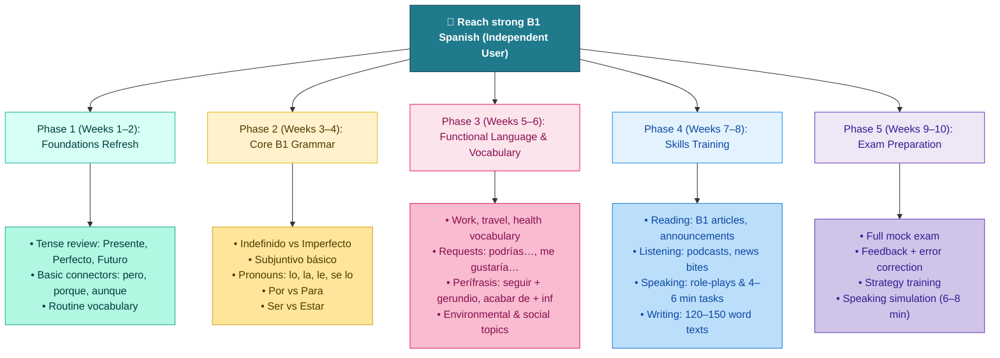
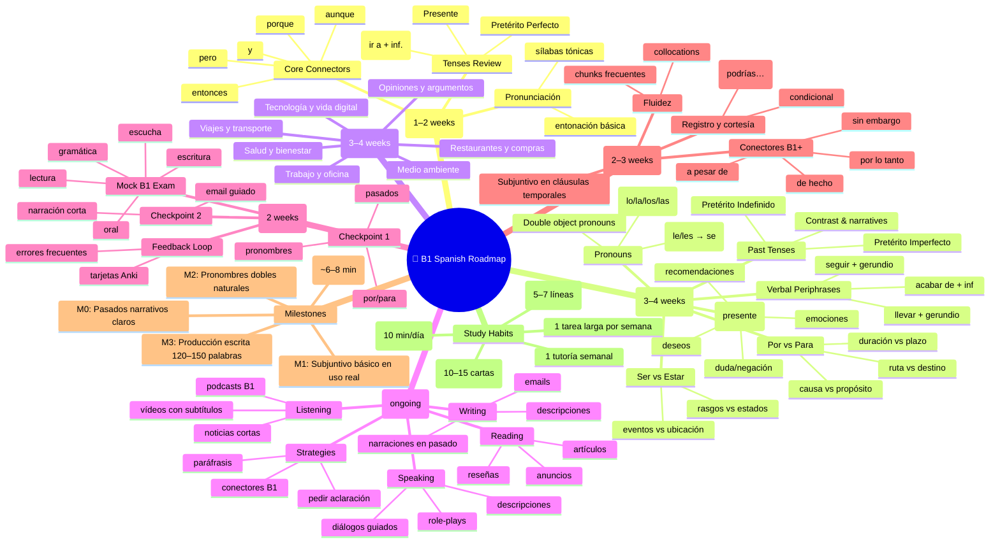

# 🗺️ Roadmap

> **Tip:** It’s designed so you can follow the roadmap top-to-bottom and left-to-right. Milestones and assessments are highlighted to track progress.

## How to use this roadmap

- **Phases** are timeboxed suggestions. Adjust based on your schedule.
- **Milestones** let you verify you’re “B1‑ready” in core areas (past tenses, subjunctive, pronouns, connected writing, oral fluency).
- **Study System** nodes are habits that boost retention and fluency (Anki, shadowing, weekly production + feedback).

###

Perfect — here is your **expanded weekly B1 roadmap table** now including **sample sentences** for each week.  
These model sentences are crafted to match **CEFR B1 difficulty** and reinforce the grammar or vocabulary focus of the week.

If you’d like, I can later export this as **Markdown, PDF, Excel, Notion‑ready tables**, or flashcards.

---

## Weekly Table with Sample Sentences

| **Week**    | **Focus Area**                   | **Grammar Targets**                              | **Vocabulary Themes**         | **Skills & Tasks**              | **Sample Sentences (B1 Level)**                                                                                                                                                             |
| ----------- | -------------------------------- | ------------------------------------------------ | ----------------------------- | ------------------------------- | ------------------------------------------------------------------------------------------------------------------------------------------------------------------------------------------- |
| **Week 1**  | Foundation Refresh               | Presente, Pretérito Perfecto, Futuro ir a + inf. | Daily routines, personal info | Short reading + listening       | - _He empezado a estudiar español otra vez._ - _Voy a organizar mejor mi tiempo esta semana._ - _Normalmente trabajo desde casa, pero hoy estoy en la oficina._                     |
| **Week 2**  | Past Tense System                | Indefinido vs. Imperfecto                        | Travel & holidays             | Write past narratives           | - _Cuando era pequeño, siempre viajaba con mis padres._ - _El año pasado fui a Valencia y lo pasé genial._ - _Hacía calor cuando llegamos al hotel._                                |
| **Week 3**  | Subjunctive Basics               | Quiero que…, Es importante que…, Dudo que…       | Preferences, emotions         | Debates + opinions              | - _Quiero que practiques conmigo todos los días._ - _Es importante que descanses bien antes del examen._ - _Dudo que él tenga tiempo hoy._                                          |
| **Week 4**  | Pronouns Mastery                 | DO/IO pronouns + double pronouns                 | Food & restaurants            | Ordering, complaints            | - _¿Me puedes traer la cuenta, por favor?_ - _Se lo di ayer, pero no lo ha leído._ - _Las compré esta mañana._                                                                      |
| **Week 5**  | Por vs Para + Ser/Estar          | Purpose, cause, duration                         | Work & office                 | Write email about work          | - _Este informe es para mi jefe._ - _Gracias por tu ayuda con el proyecto._ - _Estoy cansado porque ha sido un día largo._                                                          |
| **Week 6**  | Perífrasis Verbales + Connectors | seguir + gerundio, acabar de, llevar + gerundio  | Technology                    | Listening + narration           | - _Sigo aprendiendo nuevas herramientas de software._ - _Acabo de actualizar mi ordenador._ - _Llevo usando esta aplicación desde el año pasado._                                   |
| **Week 7**  | Functional Language              | Requests, softeners, suggestions                 | Health & wellbeing            | Doctor role‑plays               | - _¿Podrías recomendarme algo para el dolor de cabeza?_ - _Deberías beber más agua._ - _Me siento un poco mejor hoy._                                                               |
| **Week 8**  | Speaking Expansion               | Extended descriptions                            | Environment & society         | Record speaking tasks           | - _En mi opinión, deberíamos reciclar más para cuidar el planeta._ - _Lo que más me preocupa es la contaminación del aire._ - _Creo que la gente está más consciente del problema._ |
| **Week 9**  | Writing Skills                   | B1 connectors                                    | All topics                    | Write 150-word text             | - _Aunque estaba cansado, terminé el trabajo._ - _Sin embargo, decidí continuar._ - _Por lo tanto, es necesario organizarse bien._                                                  |
| **Week 10** | Mock Exam                        | Full grammar review                              | Exam vocabulary               | Reading + listening + oral exam | - _A continuación, voy a hablar sobre…_ - _En resumen, fue una experiencia muy positiva._ - _Por un lado…, pero por otro lado…_                                                     |

---

### ⭐ Want an expanded version?

We could also generate:

✔ Weekly homework checklist

✔ “Can‑Do Statements” (CEFR style)

✔ Audio-style practice prompts

✔ B1 grammar cheat sheet

✔ Vocabulary list per week (50–80 words each)

✔ Flashcards (Anki format)

---

## 🎯 1. **Key Grammar You Need at B1**

### **1.1. Past Tenses: Pretérito Indefinido vs Imperfecto**

At B1 you must clearly distinguish these:

#### **Pretérito Indefinido (completed actions)**

_Fui_, _comí_, _salí_, _tuve_, _hice_, _puse_  
Use it for:

- A finished event: _Ayer fui al gimnasio._
- A sequence of actions: _Me levanté, desayuné y salí._

#### **Pretérito Imperfecto (background)**

_iba_, _comía_, _vivía_  
Use it for:

- Descriptions: _Cuando era niño…_
- Repeated past habits: _Siempre jugaba con mis amigos._

👉 **We can practice this together anytime.**

---

### **1.2. The Subjunctive (Present)**

B1 = mastering _when_ to use it, not perfection.

Trigger words:

- _quiero que…_
- _es importante que…_
- _dudo que…_
- _cuando + future meaning_

Example:  
➡️ _Quiero que vengas._  
➡️ _Es importante que estudies más._

---

### **1.3. Pronouns (Direct + Indirect + Double Object)**

These are essential for natural B1 speech.

- Direct: _lo, la, los, las_
- Indirect: _le, les_ → becomes _se_ with another pronoun

Example:  
➡️ _Le doy el libro a María._  
➡️ _Se lo doy._

We can practice step‑by‑step.

---

### **1.4. “Por” vs “Para”**

B1 students still mix these. Quick guide:

**Por** = cause, duration, movement

- _Voy por el parque._
- _Lo hice por ti._

**Para** = destination, purpose, deadline

- _Esto es para ti._
- _Necesito el informe para mañana._

---

## 🧠 2. **B1 Vocabulary You Should Know**

### **Themed Vocabulary**

We’ll expand around topics used in B1 exams and real conversations:

- Trabajo y oficina
- Viajes y transporte
- Salud y cuerpo
- Tecnología
- Opiniones y argumentos
- Medio ambiente
- Comida y restaurantes

If you want, I can start you with a weekly vocabulary list.

---

## 🗣️ 3. Practice Exercise Right Now

Let’s start with something small. Try to translate this to Spanish:

**“When I was a child, I used to visit my grandparents every summer.”**

Write your answer, and I’ll correct it and explain why.

Or, if you prefer, write any sentence in Spanish and I’ll fix grammar + vocabulary.
